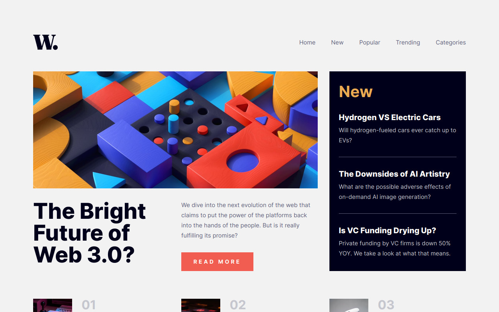

# Frontend Mentor - News homepage solution

This is a solution to the [News homepage challenge on Frontend Mentor](https://www.frontendmentor.io/challenges/news-homepage-H6SWTa1MFl). Frontend Mentor challenges help you improve your coding skills by building realistic projects. 

## Table of contents

- [Overview](#overview)
  - [The challenge](#the-challenge)
  - [Screenshot](#screenshot)
  - [Links](#links)
- [My process](#my-process)
  - [Built with](#built-with)
  - [What I learned](#what-i-learned)
  - [Continued development](#continued-development)
  - [Useful resources](#useful-resources)
- [Author](#author)


## Overview

### The challenge

Users should be able to:

- View the optimal layout for the interface depending on their device's screen size
- See hover and focus states for all interactive elements on the page

### Screenshot



### Links

- Solution URL: [https://www.frontendmentor.io/solutions/news-homepage-ApDifFlOT-](https://www.frontendmentor.io/solutions/news-homepage-ApDifFlOT-)
- Live Site URL: [https://news-homepage-dun.vercel.app/](https://news-homepage-dun.vercel.app/)

## My process

### Built with

- Semantic HTML5 markup
- Sass
- Flexbox
- CSS Grid
- Mobile-first workflow
- [React](https://reactjs.org/) - JS library

### What I learned

I learned to use interpolation in Sass:

```scss
  &__navbar {
    background: #{$dark-space-blue}80;
    }
```

### Continued development

I need to learn more about Sass.

### Useful resources

- [How to Load and Use Custom Fonts with CSS](https://www.digitalocean.com/community/tutorials/how-to-load-and-use-custom-fonts-with-css) - It helped me load the given fonts.
- [Working with Strings in Sass](https://vanseodesign.com/css/sass-strings/) - I did the background of the mobile menu using Sass interpolation, to avoid writing down the hex code, adding the opacity code at the en of the color variable.
- [Button click pulsing effect - Pure CSS](https://codepen.io/ash_s_west/pen/GRZbvym) - I based the anchor and buttons active state on this effect.

## Author

- Frontend Mentor - [@miguelzaga](https://www.frontendmentor.io/profile/miguelzaga)

